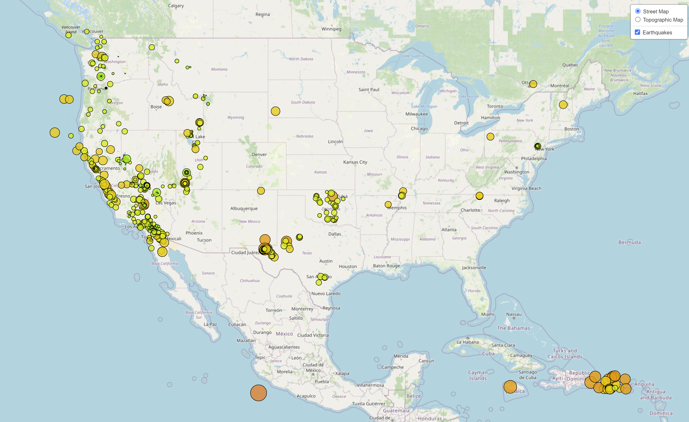

# Earthquake visualization using Leaflet

This is visualization of the earthquake data from United States Geological Survey, or USGS.
The task is to develop a way to visualize USGS data that will allow them to better educate the public and other government organizations (and hopefully secure more funding) on issues facing our planet.

## Data source
https://earthquake.usgs.gov/earthquakes/feed/v1.0/summary/all_week.geojson

## Visualization

## Tools used
JavaScript
Leaflet
D3 JS
Plotly
Html & CSS
VS Code

## References
Module Activities